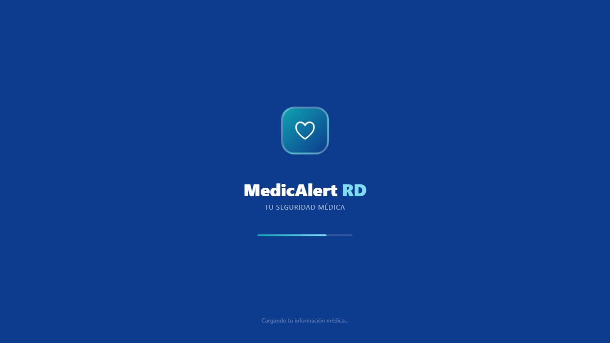
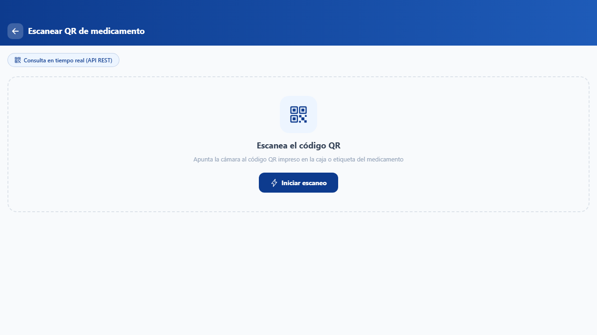
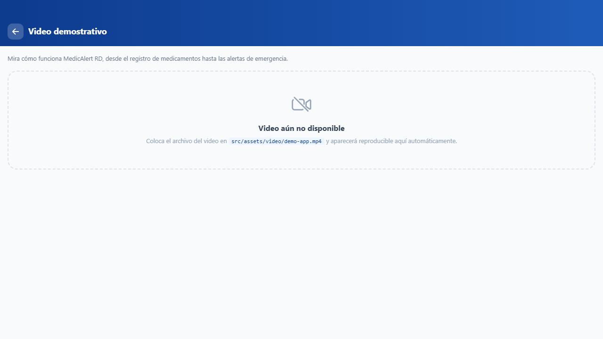

# MedicAlert RD

Aplicación móvil híbrida (Angular + Ionic + Capacitor) para la gestión de medicamentos, citas médicas e información de emergencia, pensada para adultos mayores en República Dominicana.

## Descripción

MedicAlert RD permite al usuario:

- Registrar y llevar el control de sus medicamentos (dosis, frecuencia, horarios).
- Escanear una receta médica con la cámara para detectar medicamentos automáticamente.
- **Escanear el código QR de un medicamento** y consultar en tiempo real su información pública (nombre, fabricante, propósito, advertencias) a través de una API REST.
- Ver un historial médico, citas médicas y su carné digital.
- Guardar un perfil médico (alergias, tipo de sangre, contacto de emergencia) accesible sin conexión.
- Llamar/ubicar contactos y clínicas de emergencia.
- Ver un **video demostrativo** del funcionamiento de la app.

## Cumplimiento de requerimientos del curso

| Requerimiento | Estado | Dónde |
|---|---|---|
| Consumo de API REST (`HttpClient`) | ✅ | [`src/app/services/medicamento-api.service.ts`](src/app/services/medicamento-api.service.ts) consulta la API pública [openFDA](https://open.fda.gov/apis/drug/label/) |
| Persistencia local (Ionic Storage / SQLite) | ✅ | [`src/app/services/qr-historial.service.ts`](src/app/services/qr-historial.service.ts) usa `@ionic/storage-angular` para guardar el historial de escaneos QR |
| Servicio multimedia (video) | ✅ | Página [`src/app/pages/multimedia`](src/app/pages/multimedia) — menú lateral → "Video demostrativo" |
| Cámara / escaneo de QR | ✅ | Página [`src/app/pages/escanear-qr`](src/app/pages/escanear-qr) usando `@capacitor-mlkit/barcode-scanning` |
| Estructura del repositorio | ✅ | Ver sección [Estructura del repositorio](#estructura-del-repositorio) |

## Capturas de pantalla

| Splash | Escaneo QR de medicamento | Video demostrativo |
|---|---|---|
|  |  |  |

> Las pantallas internas (Inicio, Medicamentos, Citas, etc.) requieren iniciar sesión; agrega tus propias capturas en `docs/screenshots/` después de probar la app con tu cuenta.

## Estructura del repositorio

```
MedicAlertRD/
├── src/
│   ├── app/
│   │   ├── pages/          # Páginas de la app (home, medicamentos, citas, escanear-qr, multimedia, ...)
│   │   ├── services/       # Servicios (medicamento-api, qr-historial, auth, medicamentos, ...)
│   │   ├── models/         # Interfaces TypeScript (Medicamento, HistorialItem, PerfilMedico, ...)
│   │   ├── components/     # Componentes reutilizables (network-banner, ...)
│   │   └── guards/         # Guards de rutas (auth.guard)
│   ├── assets/              # Íconos, imágenes y video demostrativo
│   └── environments/        # Configuración de Firebase (dev/prod)
├── android/                  # Proyecto nativo Android (Capacitor)
├── docs/screenshots/         # Capturas de pantalla para este README
├── package.json
└── README.md
```

## Tecnologías

- Angular 20 (standalone components)
- Ionic 8
- Capacitor 8 (Android)
- Firebase (Auth, Firestore, Storage)
- `@ionic/storage-angular` — persistencia local
- `@capacitor-mlkit/barcode-scanning` — escaneo de QR con cámara nativa
- HttpClient de Angular — consumo de la API REST [openFDA](https://open.fda.gov/apis/drug/label/)

## Instalación

### Requisitos previos

- Node.js 18+
- Angular CLI (`npm install -g @angular/cli`)
- Android Studio (solo para compilar/ejecutar en Android)

### Pasos

```bash
# 1. Clonar el repositorio
git clone https://github.com/almontemania-web/Grupo-D-Dispositivos_moviles.git
cd Grupo-D-Dispositivos_moviles

# 2. Instalar dependencias
npm install

# 3. Ejecutar en el navegador (modo desarrollo)
npm start
# abre http://localhost:4200
```

### Ejecutar en Android

```bash
npx cap sync android
npx cap open android
# luego ejecuta la app desde Android Studio
```

### Configuración de Firebase

El proyecto ya incluye la configuración de Firebase en `src/environments/environment.ts`. Si deseas usar tu propio proyecto de Firebase, reemplaza las credenciales en ese archivo (y en `environment.prod.ts` para producción).

## Video demostrativo

Para que el video se muestre en la sección **Video demostrativo** del menú, coloca el archivo en:

```
src/assets/video/demo-app.mp4
```
